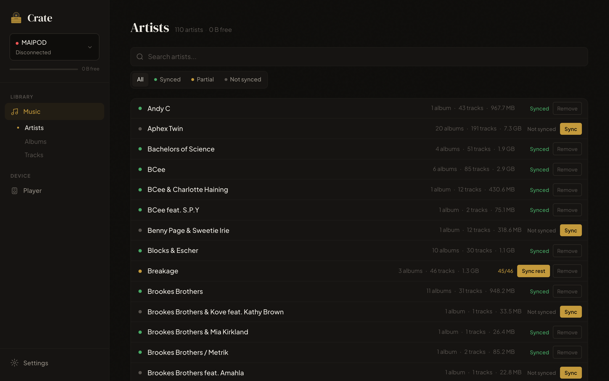
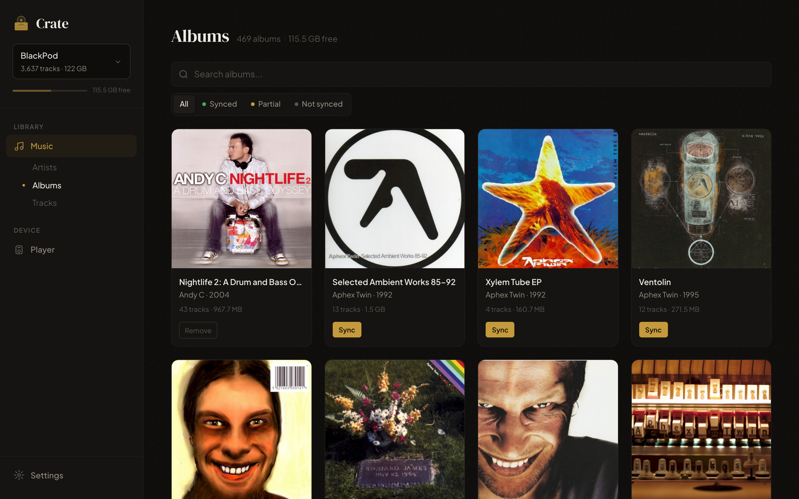
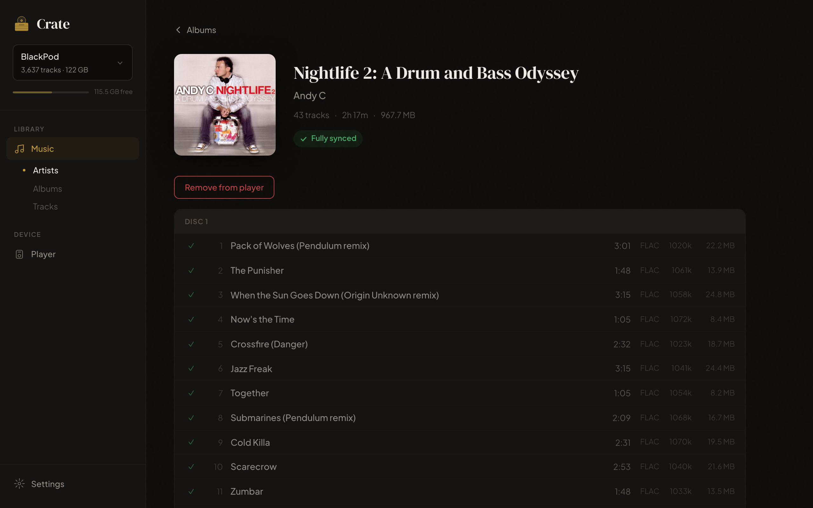
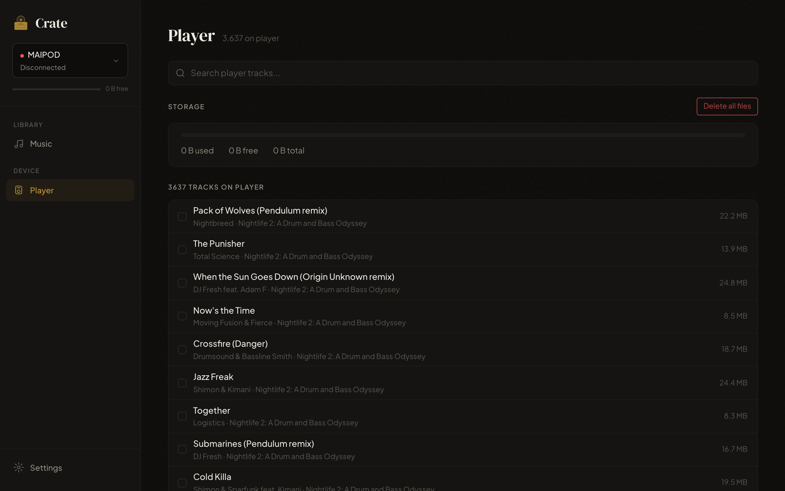
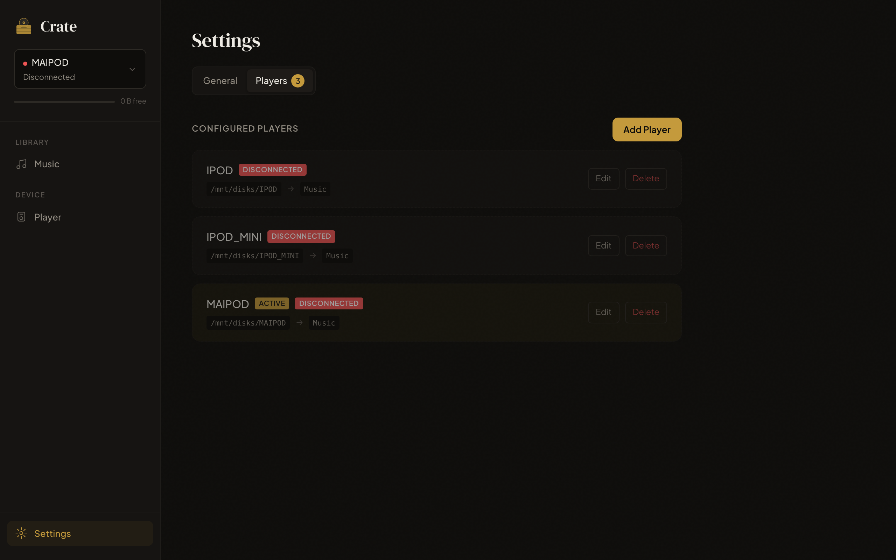

# Crate

[](https://github.com/v3rm0n/crate/actions/workflows/build.yml)
[](LICENSE)
[](https://github.com/v3rm0n/crate/pkgs/container/crate)

A web application for managing music on portable audio players. Runs as a Docker container, mounts your music library and player storage, and lets you browse, search, and sync music through a clean web interface.

Works with any DAP (digital audio player) that presents itself as a USB drive — Rockbox players, iPods, Sony Walkmans, FiiO, Shanling, and more.

## Screenshots

| Library — Artists | Library — Albums | Album detail |
|---|---|---|
|  |  |  |

| Player | Settings |
|---|---|
|  |  |

## Features

- **Library browser** — browse your music library by artist and album with search
- **Album art** — automatically extracts and displays embedded cover art
- **Sync status tracking** — instantly see which albums are fully synced, partially synced, or not on the player
- **Background sync** — copy tracks or entire albums with real-time progress tracking
- **Player browser** — view and manage what's on the player, remove tracks
- **Storage dashboard** — monitor player storage usage
- **Orphan detection** — flags files on the player that don't match anything in the library, with bulk delete
- **Multi-player support** — manage multiple DAPs from a single instance, each with a friendly alias for the UI
- **Disconnect detection** — detects when a player is unplugged and prevents operations on stale mounts
- **PWA support** — installable on iOS and Android home screens
- **First-run setup wizard** — pick or create a managed directory on the player
- **Incremental scanning** — only re-processes changed files on rescan
- **Artist name normalization** — groups artist tag variants (e.g. "The Beatles" / "Beatles") together by MusicBrainz ID

## How it works

```
Host                               Docker Container                    Player
┌────────────────┐                ┌────────────────────┐             ┌──────────┐
│ Music Library  │──── /library ──│       Crate        │── /player ──│   DAP    │
│ (Lidarr, etc.) │   (read-only)  │  SvelteKit + SQLite│ (read-write)│  Device  │
└────────────────┘                └────────────────────┘             └──────────┘
```

The app expects a well-structured music library (e.g. managed by [Lidarr](https://lidarr.audio/)) and mirrors that structure on the player. File matching is done by relative path — if `/library/Artist/Album/01 - Song.flac` exists and the same path exists under the managed directory on the player, it's considered synced.

## Quick start

Pull the image from GitHub Container Registry:

```sh
docker pull ghcr.io/v3rm0n/crate:latest
```

### Docker Compose

```yaml
services:
  crate:
    image: ghcr.io/v3rm0n/crate:latest
    container_name: crate
    ports:
      - "3000:3000"
    volumes:
      - crate-data:/data
      - /path/to/your/music/library:/library:ro
      - /mnt/disks:/mnt/disks:slave
    environment:
      - PLAYER_MOUNT_BASE=/mnt/disks
    restart: unless-stopped

volumes:
  crate-data:
```

Replace `/path/to/your/music/library` with the path to your music library and `/mnt/disks` with the directory where your DAPs are mounted.

```sh
docker compose up -d
```

Open `http://your-host-ip:3000` and follow the setup wizard.

### Docker run

```sh
docker run -d \
  --name crate \
  -p 3000:3000 \
  -v crate-data:/data \
  -v /path/to/your/music/library:/library:ro \
  -v /mnt/disks:/mnt/disks:slave \
  -e PLAYER_MOUNT_BASE=/mnt/disks \
  ghcr.io/v3rm0n/crate:latest
```

## Environment variables

| Variable | Default | Description |
|---|---|---|
| `DATA_DIR` | `/data` | Where the SQLite database is stored |
| `LIBRARY_PATH` | `/library` | Mount point for the music library |
| `PLAYER_MOUNT_BASE` | `/player` | Base path where player drives are mounted |
| `PORT` | `3000` | HTTP server port |
| `SCAN_INTERVAL` | `0` (disabled) | Auto-scan interval in minutes (e.g. `60` = rescan every hour) |
| `LOG_LEVEL` | `info` | Set to `debug` for verbose server logs |

### Multi-player support

Crate can manage multiple DAPs from a single instance. Each DAP appears as a separate "player" in the interface:

1. **Mount base path** — Set `PLAYER_MOUNT_BASE` to a directory containing your mounted drives
2. **Auto-discovery** — Crate automatically discovers devices in the mount base
3. **Per-player sync** — Each player has its own managed directory and sync status
4. **Quick switching** — Switch between active players from the sidebar dropdown

When using multiple players, the player mount base should be a parent directory that contains individual player mounts. For example:
- `/mnt/disks/iPod_Classic` — your iPod
- `/mnt/disks/FiiO_M11` — your FiiO player
- `/mnt/disks/Sony_WM1A` — your Sony Walkman

Set `PLAYER_MOUNT_BASE=/mnt/disks` and Crate will discover all three as separate manageable players.

**Important:** Use the `:slave` mount propagation flag (e.g., `/mnt/disks:/mnt/disks:slave`) so that host-side mount/unmount events (plugging or unplugging a player) are visible inside the container. Without this, the container keeps a stale copy of the mount and cannot detect disconnected players.

### Supported formats

FLAC, MP3, OGG, AAC, WAV, M4A

## First-run setup

On first launch, the setup wizard will:

1. Let you choose or create a directory on the player to manage (e.g. `Music`)
2. Scan existing files in that directory and reorganize them to match your library's folder structure (Artist/Album/Track)
3. Move files with unreadable metadata to an `Unsorted` folder
4. Scan your music library and index all tracks

## Development

```sh
npm install
npm run dev
```

Requires local directories for testing:

```sh
mkdir -p /tmp/crate-test/{library,data,players/player1,players/player2}

DATA_DIR=/tmp/crate-test/data \
LIBRARY_PATH=/tmp/crate-test/library \
PLAYER_MOUNT_BASE=/tmp/crate-test/players \
npm run dev
```

### Production build

```sh
npm run build
node build
```

## Tech stack

- [SvelteKit](https://svelte.dev/) — full-stack framework
- [better-sqlite3](https://github.com/WiseLibs/better-sqlite3) — embedded database
- [music-metadata](https://github.com/borewit/music-metadata) — audio file metadata parsing
- Node.js 22 Alpine — Docker base image

## License

[MIT](LICENSE)
